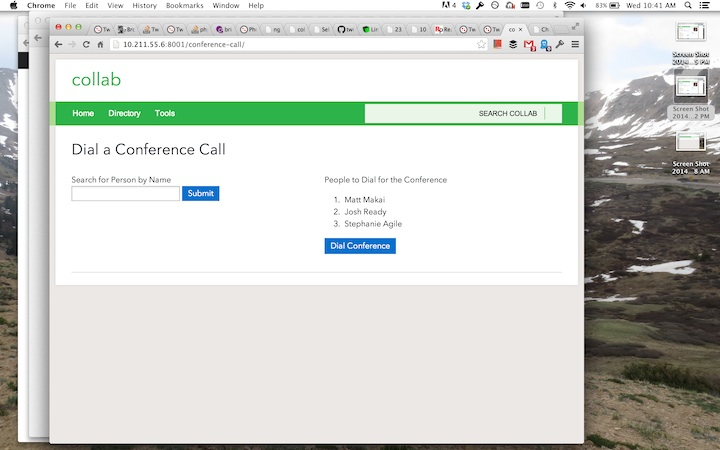

#Conference Calling

*Conference Calling* is a [Collab](https://github.com/cfpb/collab) application 
that searches the 
[Staff Directory](https://github.com/cfpb/collab-staff-directory) 
and dials every selected participant into a conference call. 


##Pages

Conferencing Calling has different views:

* Select participants
* Dial page

##Screenshot



##Installation

To use this application you will need to first have 
[Collab](https://github.com/cfpb/collab) along with 
[Staff Directory](https://github.com/cfpb/collab-staff-directory) installed.

Then, once you clone this repo, you can install the application using 
setuptools:

`python setup.py install`

Or, if you are developing with this app, you can add it to your search path 
like:

```
cd collab
ln -s ../collab-conference-call/conference_call .
```

Once the application is installed, add it to core collab's 
`INSTALLED_APPS` in your `local_settings.py` file:

```
INSTALLED_APPS += ( 'staff_directory', 'conference_call', )
```

You'll also need 3 new variables so you can use the Twilio service:

```
TWILIO_ACCOUNT_SID=''  # account sid from your Twilio user page goes here
TWILIO_AUTH_TOKEN=''   # auth token from your Twilio user page goes here
TWILIO_POSTBAKC_URL='' # collab server hostname plus /conference-call/postback/

##Contributing

Please read the [contributing guide](./CONTRIBUTING.md).
